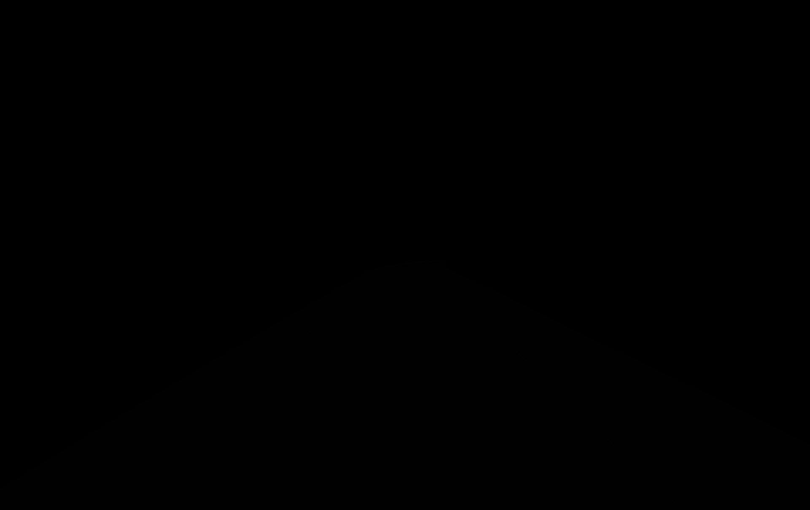
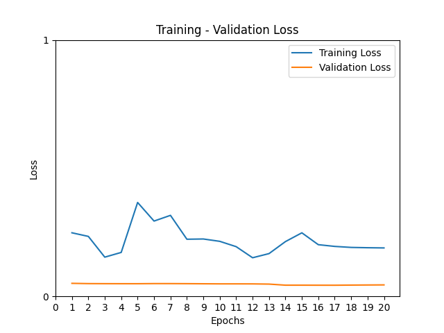

# Freespace , Solid Line , Dashed Line and Exit/Merge Line Segmentation with Fully Convolutional Neural Network (FCNN)
<br />
<br />

# json2mask.py

**Converts data in json to mask**
```
for obj in json_dict["objects"]:
        # Check the objects ‘classTitle’ is ‘Freespace’ or not.
        if obj['classTitle']=='Freespace':
            mask = cv2.fillPoly(mask, np.array([obj['points']['exterior']]), color=1)

    for obj in json_dict["objects"]:
        if obj['classTitle']=='Dashed Line':
                mask = cv2.polylines(mask,np.array([obj['points']['exterior']]),False,color=2)

    for obj in json_dict["objects"]:
        if obj['classTitle']=='Exit/Merge Line':
                mask = cv2.polylines(mask,np.array([obj['points']['exterior']]),False,color=3)

    for obj in json_dict["objects"]:
        if obj['classTitle']=='Solid Line':
                mask = cv2.polylines(mask,np.array([obj['points']['exterior']]),False,color=4)
```

# mask_on_image.py
**Read mask and change the color of the pixels on the original image that corresponds to the mask part and create new image**
```
 mask  = cv2.imread(mask_path, 0).astype(np.uint8)
        image = cv2.imread(image_path).astype(np.uint8)
        same_img  = image.copy()
        image[mask==1, :] = (255,200,200)
        image[mask==2, :] = (0,255,0)
        image[mask==3, :] = (255,0,0)
        image[mask==4, :] = (0,0,255)
        new_img = (image/2 + same_img/2).astype(np.uint8)
```
### Freespace and Solid Line masks
<p align="center">
  
</p>
<br />

# preprocess.py
**We need to prepare the data to feed the network: we have - data/masks, data/images - directories where we prepared masks and input images. Then, convert each file/image into a tensor for our purpose.**  

tensorize_image function:
```
        torchlike_image = torchlike_data(image)
        # Add into the list
        local_image_list.append(torchlike_image)
        # Convert from list structure to torch tensor
        torch_image = torch.tensor(local_image_list,dtype=torch.float32)
```
tensorize_mask function:
```
        # Apply One-Hot Encoding to image
        mask = one_hot_encoder(mask, n_class)
        # Change input structure according to pytorch input structure
        torchlike_mask = torchlike_data(mask)
        local_mask_list.append(torchlike_mask)
        torch_mask = torch.tensor(local_mask_list,dtype=torch.float32)
```
one_hot_encoder function:
```
    encoded_data = np.zeros((*data.shape, n_class), dtype=np.uint)

    # Define labels
    labels = [[0,0,0,0,0],[0,0,0,0,1],[0,0,0,1,0],[0,0,0,1,1],[0,0,1,0,0]]

    for i in range(n_class):
        encoded_data[data == i] = labels[i]
    return encoded_data
```
# model.py
**Building neural network model**
```
class FoInternNet(nn.Module):
    def __init__(self, input_size, n_classes):
        super(FoInternNet, self).__init__()
        self.input_size = input_size
        self.n_classes = n_classes

        # Here, layers are given as example, please feel free to modify them. 
        self.conv1 = nn.Conv2d(in_channels=3, out_channels=64, kernel_size=1, stride=1)
        self.conv2 = nn.Conv2d(in_channels=64, out_channels=32, kernel_size=1, stride=1)
        self.conv3 = nn.Conv2d(in_channels=32, out_channels=n_classes, kernel_size=1, stride=1)

    def forward(self, x):
        """This function feeds input data into the model layers defined.
        Args:
            x : input data
        """
        x = self.conv1(x)
        x = F.relu(x)
        x = self.conv2(x)
        x = F.relu(x)
        x = torch.sigmoid(self.conv3(x))
        return x
```

# train.py
**Training model**
  
Training funciton:
```
for epoch in range(epochs):
    for (train_input, train_label) in zip(train_input_path_list, train_label_path_list):
        Xbatch = tensorize_image([train_input], input_shape, cuda)
        ybatch = tensorize_mask([train_label], input_shape, n_classes, cuda)

        model.zero_grad()
        output = model(Xbatch)
        loss = criterion(output, ybatch)
        loss.backward()
        optimizer.step()
        taccuracy = (output.round() == ybatch).float().mean()
    print(f"loss : {loss} in epoch : {epoch}")
    print(f"Train Accuracy {taccuracy}")
    tracc.append(taccuracy)  
    trlist.append(loss.item())
```
Validation funciton:
```
for epoch in range(epochs):
    for (valid_input_path, valid_label_path) in zip(valid_input_path_list, valid_label_path_list):
            Xbatch = tensorize_image([valid_input_path], input_shape, cuda)
            ybatch = tensorize_mask([valid_label_path], input_shape, n_classes, cuda)
            model.zero_grad()
            output = model(Xbatch)
            loss = criterion(output, ybatch)
            loss.backward()
            optimizer.step()
            vaccuracy = (output.round() == ybatch).float().mean()
    print(f"Validation Accuracy {vaccuracy}")
    print(f"Validation loss : {loss} in epoch : {epoch}")
    valacc.append(vaccuracy)
    valloss.append(loss.item())
```


<p align="center">
  <h2 align="center">Accuracy and Loss Graphs</h2>
</p>
<p align="left">
  
  
</p>
<p align="right">
  
</p>


